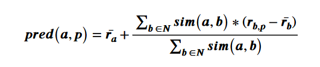

## Recommender System 
Repository for assignments for [Recommender system course in Tampere university](https://www.tuni.fi/en/students-guide/curriculum/course-units/uta-ykoodi-53272?year=2023).
The assignments are an implementation for certain method for recommender system. 

The assignment and sample runs were included in assignments info folder.

#### How To Run:
Run the assignmentX.py file. Ex:

    python assignment1.py

The Python code expect the following installed global packages:
- pandas
- sciPy

### Assignment 1:
The assignment is for User-based Collaborative Filtering Recommendations.
Here are some things about the implementation:
- We use Pandas to read and manipulate the data.
- We use the pearson correlation equation for finding the similar users. 
- we use the library scipy for the pearson correlation implementation.
- For pearson correlation, we only take into account when 2 users have more than 4 common movies with ratings. This help to improve the reliability of the result.
- We use threshold of 0.7 for correlation to find the similar users.
- We used the following prediction function:

- For finding the find most relevant movies for a user, we will use the first 1000 movies only, because the computation take too long and we already have 10 movies with predicted result of 5.
- Some movie ratings we are unable to make a user preference prediction because not enough similar users in the data set. Those items are skipped when search for relevant movies.